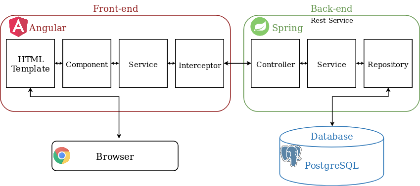

# Web store

### Background story
A small company that grows and sales plants needs a website to advertise their products.
People who search for local plant selling store should be able to easily find out,
products that are being sold there. As the store doesn't offer home delivery, online purchases
are not important.

### Modules
Web store company sees following components to the information system:
1) Home / News module
2) Products module
3) Contact module
4) Login module 
5) Administration module

##### Home / News module
Basically a landing page. New users should end up here and see latest news.
As an admin (logged in user) you should be able to easily add / remove news.

##### Products module
Upon opening products page a customer should see list of all products.
All products should also have images as well as name, description and price.
Customers should be able to see more detailed information by clicking on products.
It should be also possible to filter products by category or search by name or price.

##### Contact module
Contact page should show all of the basic company contact information. (name, address, phone, email)
There should also be an interactive map, which shows store location for easier navigation.

##### Login module
There should be a page, where administrator can log in, to get access to editing the page.

##### Administration module
Admin can add/edit/remove all news and products that are in the store. It would be good if
there was an option to also see basic statistics of the page (visits, views os certain product, etc).  
  
# Architecture  

Web store data will be stored in a PostgreSQL database, which will be accessed and modified by a Spring RESTful API backend. 
The customer will interact with the store using an Angular frontend which in turn uses the aforementioned API.

  
# User Stories

### Must haves
* [x] As a customer I can view latest announcements.
* [x] As a customer I can view all the available products.
* [x] As a customer I can view details for a specific product by clicking on it.
* [x] As a customer I can sort products by price / availability.
* [x] As a customer I can filter products by category.
* [ ] As an admin I can log in on a separate login page.
* [x] As an admin I can add/delete products, categories and announcements. _(currently everyone can do it as we have
 not learnt spring security)_

### Nice to haves
* [x] As a customer I can search for products by name.
* [x] As a customer I can find contact information through the menu to order products.
* [x] As a customer I can view store location from interactive map
* [ ] As a customer I can view most popular products
* [ ] As a admin I can view statistics of visitors
* [ ] As a admin I can pin my current outlet location to contacts map
